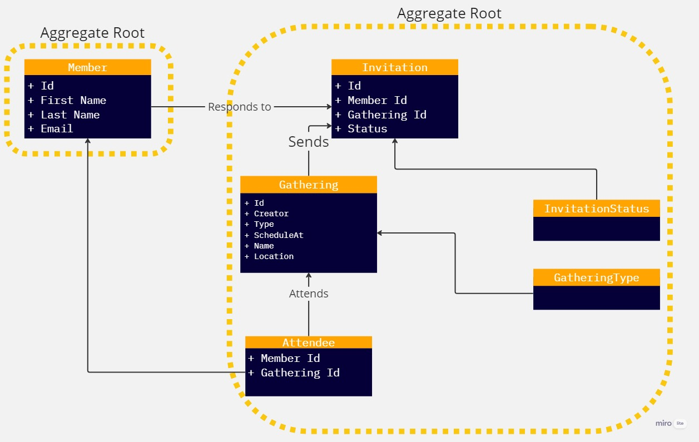
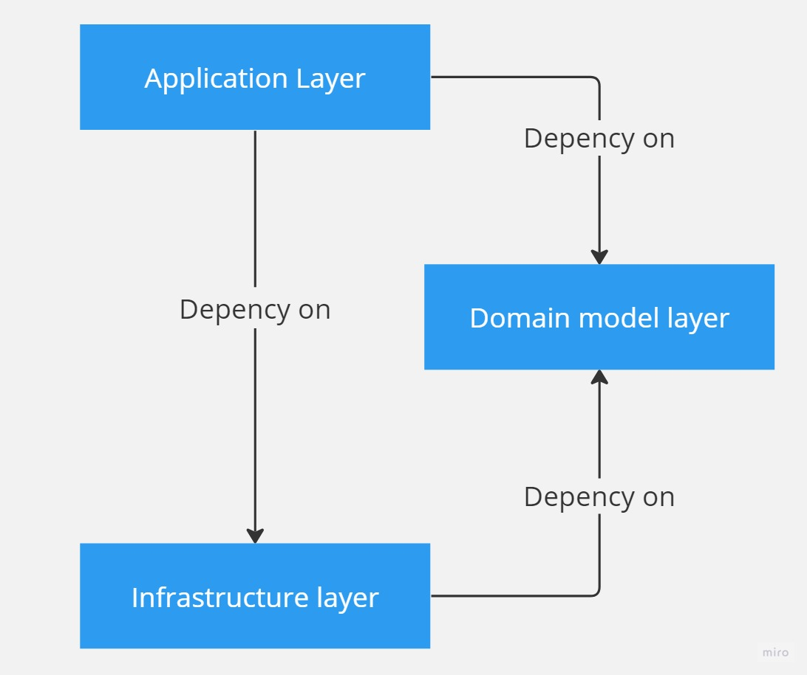

# eGathering
- 這是一個練習DDD的Api專案
## You must know
- [Basic DDD design](https://learn.microsoft.com/en-us/dotnet/architecture/microservices/microservice-ddd-cqrs-patterns/ddd-oriented-microservice)
- [CQRS design](https://learn.microsoft.com/en-us/dotnet/architecture/microservices/microservice-ddd-cqrs-patterns/cqrs-microservice-reads)
- [Aggregate design](https://learn.microsoft.com/en-us/dotnet/architecture/microservices/microservice-ddd-cqrs-patterns/microservice-domain-model#the-aggregate-pattern)
- [Value Object](https://learn.microsoft.com/en-us/dotnet/architecture/microservices/microservice-ddd-cqrs-patterns/implement-value-objects)
- [Domain event](https://learn.microsoft.com/en-us/dotnet/architecture/microservices/microservice-ddd-cqrs-patterns/domain-events-design-implementation)
## 架構圖

## Layer介紹

### Application layer
- 依賴於Domain model layer，因此可以使用到Entity object與Repository介面。
- 依賴於Infrastructure layer，並藉由DI將Infra層實作的Repository可被DI注入。
- 此層可處理Domain event handler。

### Domain model layer
- 理論上本層不會去依賴於任何一層。
- 此層於實作Domain entities、Aggregate roots與Value object。
- Repository介面設計在此層。
- Domain event於此層觸發

### Infrastructure layer
- 依賴於Domain model layer，因此可使用到Entity object來處理EF Core。
- 此層處理異質系統溝通、寄信、MQ或Cache。
    - 而介面設計在Domain layer。
- Domain event publisher在此啟用。

## Used tools
- MediatR
    - 用於Application與Domain之間的溝通。
    - 管理Domain event。
- NetArchTest.Rules
- Serilog.AspNetCore
- AspNetCore.HealthChecks.SqlServer
- Scrutor
- FluentValidation
- FluentValidation.DependencyInjection
## About Reference
- [Microsoft Learn - Tackle Business Complexity in a Microservice with DDD and CQRS Patterns](https://learn.microsoft.com/en-us/dotnet/architecture/microservices/microservice-ddd-cqrs-patterns/)
- [Milan Jovanović - Clean Architecture & DDD Series](https://youtube.com/playlist?list=PLYpjLpq5ZDGstQ5afRz-34o_0dexr1RGa&si=ovEVenWS87A8yyhT)
- [GitHub - dotnet- architecture-eShopOnContainers-sample-code](https://github.com/dotnet-architecture/eShopOnContainers/tree/dev/src/Services/Ordering)